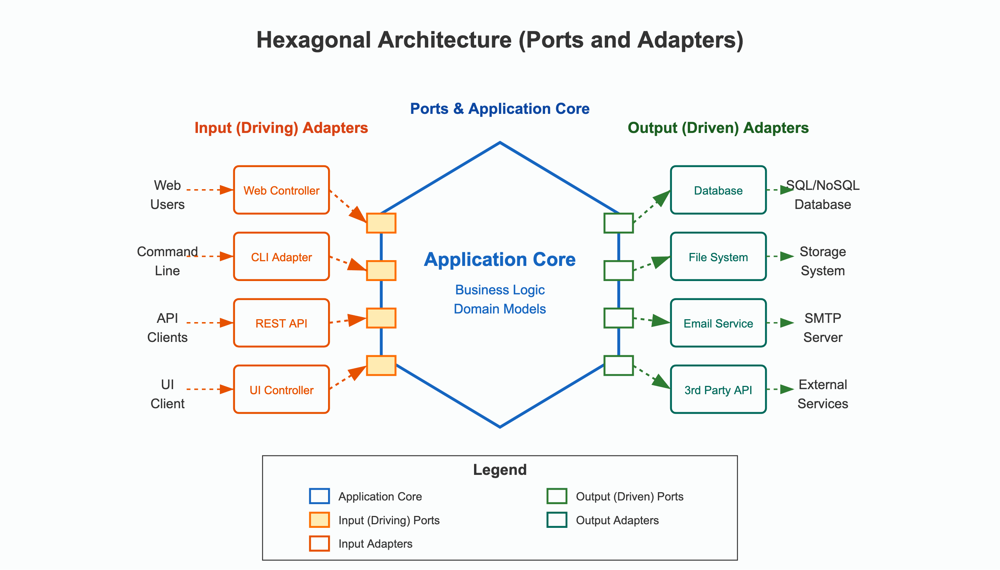
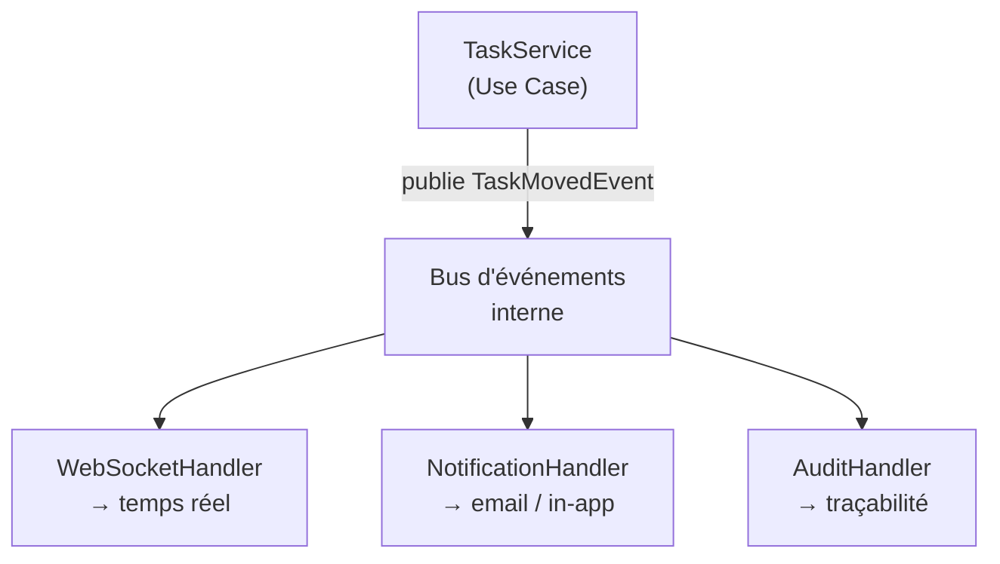

# TaskFlow — Architecture Logicielle Souple & Durable

> Cours ESGI · Mastère Architecture Logicielle · 2025-2026


## Concepts fondamentaux

Avant de coder la première ligne, vous devez comprendre les trois piliers théoriques de ce cours.


### Architecture Hexagonale (Ports & Adapters)

L'architecture hexagonale, proposée par Alistair Cockburn en 2005, a un objectif simple : **isoler le cœur métier de l'application de tout ce qui est technique** (base de données, HTTP, WebSocket, emails…).

L'idée centrale : votre logique métier ne doit pas savoir si elle est appelée par une API REST, un job CRON ou un test unitaire. Elle ne doit pas non plus savoir si les données viennent de PostgreSQL, MongoDB ou d'un fichier JSON.

#### Les trois zones

| Zone | Contenu | Principe |
|------|---------|----------|
| **Domaine** (centre) | Entités, règles métier, logique | Aucune dépendance technique. Pur TypeScript. |
| **Ports** | Interfaces (contrats) | Définissent CE QUE le domaine attend, pas COMMENT |
| **Adaptateurs** | Implémentations concrètes | Branchent le monde réel sur les ports |



#### Ce que ça change concrètement

- Vous pouvez **tester** vos services sans base de données (remplacer l'adaptateur par un mock)
- Vous pouvez **changer de BDD** sans toucher un seul service
- Vous pouvez **ajouter un canal de notification** sans modifier le service qui notifie
- Quand le client change les specs, seuls les adaptateurs bougent. Le domaine reste stable.

> Dans NestJS, le **controller** est généralement l'adaptateur entrant.
> Le **port d'entrée** peut être matérialisé par un use case ou une interface applicative exposée au controller.
> Le **repository (interface)** joue le rôle de port de sortie.
> `OrmRepository` est un adaptateur sortant.
>
> Attention : ce mapping est **indicatif**, pas automatique.
> Un fichier décoré avec `@Injectable()` n'appartient pas forcément au domaine.
> Ce n'est pas le framework qui rend votre architecture hexagonale, mais **l'endroit où vivent les règles métier** et **le sens des dépendances**.
>
> Exemple :
> un `TaskService` NestJS qui dépend d'une interface `TaskRepository` et publie un événement métier reste compatible avec l'architecture hexagonale.
> En revanche, un `TaskService` qui importe directement un ORM, envoie des emails et parle au WebSocket mélange domaine et technique, même s'il est bien rangé dans un dossier `services/`.

---

### Domain-Driven Design (DDD)

Le DDD, formalisé par Eric Evans, est une approche de conception centrée sur le **langage métier** et les **règles du domaine**.

#### Concepts clés à retenir pour ce cours

| Concept | Définition | Exemple TaskFlow |
|---------|-----------|-----------------|
| **Entité** | Objet avec une identité persistante | `Project`, `Task`, `User` |
| **Value Object** | Objet sans identité, défini par sa valeur | `TaskStatus`, `Role` |
| **Aggregate** | Groupe d'entités avec une racine | `Project` contient ses `Task` |
| **Repository** | Abstraction d'accès aux données | `ProjectRepository` (interface) |
| **Use Case / Application Service** | Orchestration d'une opération métier | `createProject()`, `moveTask()` |
| **Domain Event** | Ce qui s'est passé dans le domaine | `TaskMovedEvent` |
| **Bounded Context** | Frontière où un modèle est cohérent | Le contexte `Notifications` est distinct du contexte `Kanban` |

#### La règle d'or

> **Les règles métier vivent dans les entités et les services du domaine. Jamais dans les controllers. Jamais dans les repositories.**

Si vous écrivez une règle de gestion dans un controller, c'est une dette architecturale. Cette règle appartient à l'entité ou au service.

#### Ubiquitous Language

DDD insiste sur un **langage commun** entre développeurs et métier. Dans ce projet :

- On dit `déplacer une tâche`, pas `mettre à jour le statut`
- On dit `workspace`, pas `organisation` ou `tenant`
- On dit `membre`, pas `utilisateur` ou `participant`

Ce langage doit se retrouver dans les noms de classes, méthodes et événements du code.

---

### Architecture Event-Driven (Domain Events)

Ce cours intègre un troisième pilier : **l'architecture orientée événements**, appliquée au niveau du domaine.

#### Principe

Quand quelque chose de significatif se produit dans le domaine, il n'appelle pas directement les autres composants — il **publie un événement** sur un bus interne. Les composants intéressés s'y abonnent de manière indépendante.



#### Ce que ça apporte

| Sans events | Avec events |
|------------|-------------|
| `TaskService` appelle `NotificationService`, `WebSocketGateway`… | `TaskService` publie un event — il ne connaît rien d'autre |
| Ajouter Slack = modifier `TaskService` | Ajouter Slack = créer `SlackHandler`, brancher sur le bus |
| Tester `TaskService` = mocker chaque dépendance | Tester `TaskService` = vérifier qu'il publie le bon event |
| Un handler qui plante peut casser tout le flux | Chaque handler est isolé — les autres continuent |

#### Événements du projet TaskFlow

| Événement | Produit par | Consommé par |
|-----------|------------|--------------|
| `task.created` | `TaskService` | `NotificationHandler`, `AuditHandler` |
| `task.moved` | `TaskService` | `WebSocketHandler`, `NotificationHandler`, `AuditHandler` |
| `task.assigned` | `TaskService` | `NotificationHandler`, `AuditHandler` |
| `member.added` | `ProjectService` | `NotificationHandler`, `AuditHandler` |
| `project.created` | `ProjectService` | `AuditHandler` |

> **Règle :** un service du domaine ne connaît jamais ses consommateurs. Il publie et oublie.

---

## Le projet : TaskFlow

**TaskFlow** est une plateforme de gestion de projets de type Kanban (Trello/Jira-like).

Vous la construisez progressivement sur 19h, en 4 phases. À chaque phase, le client (votre enseignant) envoie de nouvelles exigences — les **disruptions**. Votre architecture doit les absorber sans réécriture.

### Fonctionnalités initiales (Phase 1)

- Créer et gérer des projets
- Créer, assigner et déplacer des tâches (Kanban : Todo → In Progress → Done)
- Gérer les membres d'un projet (identifiant utilisateur simulé — pas d'authentification en Phase 1)
- Vue Kanban minimale : colonnes Todo / In Progress / Done, déplacement de tâche
- Publication d'events domaine dès cette phase

> Le frontend est ici **un adaptateur entrant** parmi d'autres.
> Son rôle est de démontrer l'usage du système, pas de concentrer l'effort principal du projet.
> L'évaluation porte d'abord sur la **qualité de l'architecture**, la séparation des responsabilités et la capacité à absorber le changement.
> Une interface simple mais propre et fonctionnelle vaut mieux qu'une UI très ambitieuse construite au détriment du domaine, des tests ou du découplage.

### Stack de référence

| Couche | Technologie |
|--------|-------------|
| Frontend | Next.js (App Router) + React |
| Backend | NestJS |
| Base de données | PostgreSQL + ORM |
| Tests | Jest + Testing Library |
| CI | GitHub Actions |
| Déploiement | Docker + Docker Compose |

> **Stack libre.** Vous pouvez adopter une stack différente si vous êtes déjà à l'aise avec (Java Spring Boot, Python FastAPI, Go…). Les exemples fournis dans ce repository utilisent NestJS — les concepts s'appliquent à n'importe quel framework.
> Dans tous les cas, le choix de stack doit être votre **premier ADR** (ADR-001), avec les alternatives envisagées et les raisons du choix.

---

## Règles du projet

1. **Un ADR par décision technique significative.** Template fourni dans [`docs/ADR-template.md`](docs/ADR-template.md).
2. **Aucune logique métier dans les controllers.** Les controllers reçoivent et délèguent, les services décident.
3. **Aucun accès direct à l'ORM/BDD depuis les services.** Toujours passer par une interface de repository.
4. **Les tests unitaires ne touchent pas la base de données.** Utiliser des mocks du repository.
5. **À partir du Rendu 2, `docker compose up` doit fonctionner depuis un clone propre**, sans configuration manuelle autre que le `.env`.
6. **Commits réguliers et structurés.** Les métriques `git diff --stat` entre les rendus font partie de l'évaluation.
7. **Chaque rendu doit être figé par un tag Git poussé sur le dépôt de l'équipe** : `rendu-1`, `rendu-2`, `rendu-3`. Le tag fait foi pour l'évaluation.

---

## Priorités et périmètre minimal

Si vous manquez de temps, **ne cherchez pas à tout faire au même niveau de finition**. Le projet évalue d'abord votre capacité à construire une architecture stable et défendable.

### Ordre de priorité recommandé

1. **Domaine et cas d'usage**
   Entités, règles métier, services applicatifs, interfaces de repository, tests unitaires sans base de données.
2. **API et intégration minimale**
   Endpoints REST, persistance, procédure de démarrage simple et documentée. L'authentification n'est pas requise en Phase 1.
3. **Événements et absorption du changement**
   Publication d'événements, handlers découplés, analyse d'impact, stabilité des services existants.
4. **Interface utilisateur**
   Frontend simple, lisible et suffisant pour démontrer les cas d'usage.
5. **Finition et bonus**
   UI avancée, optimisations, confort développeur, enrichissements non indispensables.

### Périmètre minimal attendu

Un rendu peut être considéré comme solide s'il respecte au minimum les points suivants :

- Les règles métier vivent dans le domaine et non dans les controllers
- Les services ne dépendent pas directement d'un ORM ou d'un autre accès bas niveau à la base
- Les tests unitaires couvrent les cas métier principaux sans toucher à la base de données
- À partir du Rendu 2, `docker compose up` permet de lancer le projet depuis un clone propre
- Les disruptions sont absorbées par ajout d'adaptateurs, handlers ou nouvelles implémentations, sans réécriture complète du domaine

### Arbitrage attendu

En cas de manque de temps, il est préférable de livrer :

- une API propre avec tests et un frontend minimal,
- plutôt qu'un frontend riche branché sur une architecture fragile

- une démonstration partielle mais cohérente,
- plutôt qu'un grand nombre de fonctionnalités codées en contournant les règles du projet

---

## Organisation

### Équipes

- **Binômes** (2 étudiants)
- Forker ce repository, nommer le dépôt `taskflow-<nom-binome>`
- Remplir le fichier [`TEMPLATE.md`](TEMPLATE.md) avec les informations de votre équipe
- À la fin de chaque phase, créer et pousser le tag correspondant : `rendu-1`, `rendu-2`, `rendu-3`

### Planning

| Phase | Durée | Contenu | Rendu à |
|-------|-------|---------|---------|
| 1 — Fondations | 7h30 | Présentation du projet + architecture de base + tests | 7h30 |
| 2 — Évolution | 6h | Disruption #1 — absorption du changement | 13h30 |
| 3 — Résilience | 3h | Disruption #2 — survivre au chaos | 16h30 |
| 4 — Soutenance | 2h30 | Démo live + questions | — |

> Les disruptions vous seront transmises par l'enseignant en temps voulu. Vous ne les connaissez pas à l'avance.

### Découpage horaire indicatif — Phase 1

| Tranche | Durée | Objectif |
|---------|-------|----------|
| 0h00 – 0h30 | 30 min | Présentation enseignant + constitution des binômes + fork |
| 0h30 – 1h30 | 1h | Scaffold NestJS + ORM + structure hexagonale + module `project` |
| 1h30 – 3h30 | 2h | Module `task` complet : entité avec Value Object `TaskStatus`, transitions valides, service qui publie des events |
| 3h30 – 4h30 | 1h | `ConsoleHandler` branché sur `task.created` et `task.moved` (affiche event + taskId + horodatage) |
| 4h30 – 5h30 | 1h | Tests unitaires : transitions de statut + publication d'events (sans BDD) |
| 5h30 – 6h30 | 1h | Frontend minimal : page unique, colonnes Kanban, bouton pour déplacer une tâche |
| 6h30 – 7h30 | 1h | 3 ADR + schéma d'architecture + relecture + création du tag `rendu-1` |

---

## Livrables

Chaque rendu officiel est identifié par un **tag Git** poussé sur le dépôt de l'équipe :

- `rendu-1` pour le Rendu 1
- `rendu-2` pour le Rendu 2
- `rendu-3` pour le Rendu 3

Les analyses d'impact et les métriques (`git diff --stat`) s'appuient sur ces tags.

### Rendu 1 — Fondations *(à 7h30)*

**Début de séance (30 min) — Présentation par l'enseignant :**
- Présentation du projet TaskFlow et du contexte pédagogique
- Rappel des concepts : architecture hexagonale, DDD, domain events
- Règles du jeu : ADR, disruptions, évaluation
- Constitution des binômes et fork du repository

**Code attendu :**
- Module `project` : controller, service, interface repository + implémentation ORM
- Module `task` : même structure, avec un Value Object `TaskStatus` gérant les transitions valides (Todo → In Progress → Done)
- Publication d'au moins deux domain events (`task.created`, `task.moved`)
- Un `ConsoleHandler` branché sur ces deux events — à chaque event, il affiche dans la console le nom de l'event, l'identifiant de la tâche et l'horodatage
- Frontend : page unique affichant les tâches en colonnes Kanban, avec possibilité de déplacer une tâche (un bouton suffit — drag-and-drop non requis)
- Tests unitaires des services : transitions de statut, publication d'events (aucun appel BDD)
- Authentification non requise — utiliser un identifiant utilisateur simulé (header `X-User-Id` ou constante)
- Procédure de démarrage simple et documentée pour lancer le projet localement

**Documentation (dans `docs/`) :**
- Minimum 3 ADR (dont ADR-001 : choix de stack)
- Schéma d'architecture
- Tag Git `rendu-1` créé et poussé

---

### Rendu 2 — Évolution *(à 13h30)*

A la fin de la Phase 1, vous recevez la **Disruption #1**.

**Code attendu :**
- Livraison de toutes les fonctionnalités demandées dans la disruption
- `docker-compose.yml` mis à jour avec environnements production **et** staging
- `docker compose up` fonctionnel depuis un clone propre
- Pipeline GitHub Actions verte (lint + tests + build)

**Documentation (dans `docs/`) :**
- Minimum 3 nouveaux ADR couvrant les choix de la disruption
- Schéma d'architecture mis à jour
- **Analyse d'impact** : quels fichiers ont été modifiés ? lesquels sont restés stables ? pourquoi ?
- Tag Git `rendu-2` créé et poussé

---

### Rendu 3 — Résilience *(à 16h30)*

A la fin de la Phase 2, vous recevez la **Disruption #2**.

**Code attendu :**
- Livraison de toutes les fonctionnalités demandées dans la disruption

**Documentation (dans `docs/`) :**
- ADR pour chaque choix important de la disruption
- Tableau des scénarios de panne : situation, comportement attendu, comportement observé
- Tag Git `rendu-3` créé et poussé

**Démonstration live obligatoire (5 minutes) :**
- `docker compose up` depuis un clone propre — tout démarre sans intervention
- Simuler une panne et prouver que le système continue
- Montrer deux versions de l'API coexister

---

### Soutenance *(démo + questions/réponses)*

Chaque binôme présente son projet en live, suivi d'un échange de questions/réponses (15–20 minutes par équipe).

---

## Évaluation

| Livrable | Coefficient |
|----------|-------------|
| Rendu 1 — Fondations | 20 % |
| Rendu 2 — Évolution | 25 % |
| Rendu 3 — Résilience | 30 % |
| Soutenance | 25 % |

L'évaluation suit deux axes complémentaires :

- **Qualité architecturale** : séparation des responsabilités, stabilité du domaine, découplage, tests, pertinence des ADR
- **Complétude et maturité du système** : couverture fonctionnelle, robustesse de la démonstration, qualité opérationnelle (`docker compose`, CI, coexistence des versions)

Une équipe peut donc être mieux évaluée avec une couverture fonctionnelle partielle mais une architecture cohérente et défendable qu'avec un système plus complet construit au prix d'un fort couplage ou d'une réécriture.

Détail des critères par rendu : [`docs/grille-evaluation.md`](docs/grille-evaluation.md)

---

## Structure attendue du dépôt

```
taskflow-<equipe>/
├── README.md                   ← ce fichier (ne pas modifier)
├── TEMPLATE.md                 ← votre dossier projet (à remplir)
├── docs/
│   ├── ADR-template.md
│   ├── ADR-000.md              ← exemple d'ADR rempli
│   ├── ADR-001.md
│   ├── ADR-002.md
│   ├── ADR-003.md
│   ├── architecture.png
│   ├── cheat-sheet.md
│   └── grille-evaluation.md
├── taskflow-api/               ← backend NestJS
├── taskflow-web/               ← frontend Next.js
├── docker-compose.yml
├── .env.example
├── .github/
│   └── workflows/
│       └── ci.yml
└── .gitignore
```

**Structure interne d'un module NestJS en architecture hexagonale :**

```
taskflow-api/src/
└── project/
    ├── domain/
    │   ├── project.entity.ts          ← entité + règles métier
    │   ├── project.repository.ts      ← interface (port de sortie)
    │   └── project-created.event.ts   ← domain event
    ├── application/
    │   └── project.service.ts         ← use case / orchestration
    ├── infrastructure/
    │   └── orm-project.repository.ts  ← adaptateur sortant (ORM)
    └── presentation/
        └── project.controller.ts      ← adaptateur entrant (HTTP)
```

> `domain/` ne dépend de rien. `application/` dépend uniquement de `domain/`. `infrastructure/` et `presentation/` dépendent de `application/` et `domain/`. Jamais l'inverse.

---

## Ressources

| Fichier | Contenu |
|---------|---------|
| [`docs/ADR-template.md`](docs/ADR-template.md) | Template vierge pour vos ADR |
| [`docs/ADR-000.md`](docs/ADR-000.md) | Exemple d'ADR rempli |
| [`docs/grille-evaluation.md`](docs/grille-evaluation.md) | Critères et barèmes détaillés |
| [`docs/cheat-sheet.md`](docs/cheat-sheet.md) | Commandes NestJS, ORM, Docker, Git |
| [`TEMPLATE.md`](TEMPLATE.md) | Dossier projet à remplir par l'équipe |

---

> Un bon architecte n'est pas celui qui écrit le code parfait du premier coup.
> C'est celui dont le code **tient la route quand tout change**.
