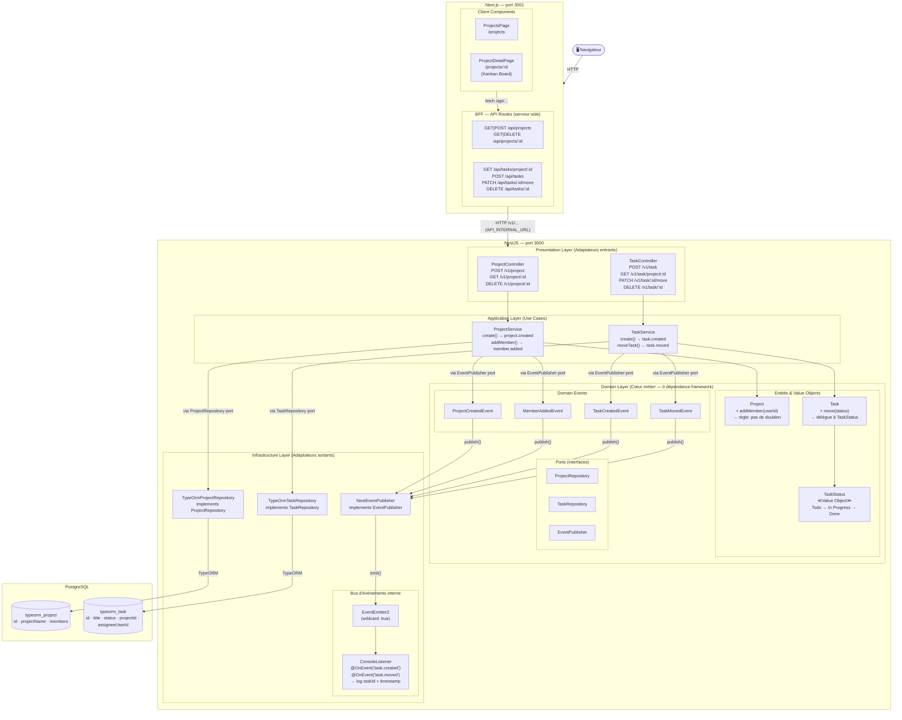
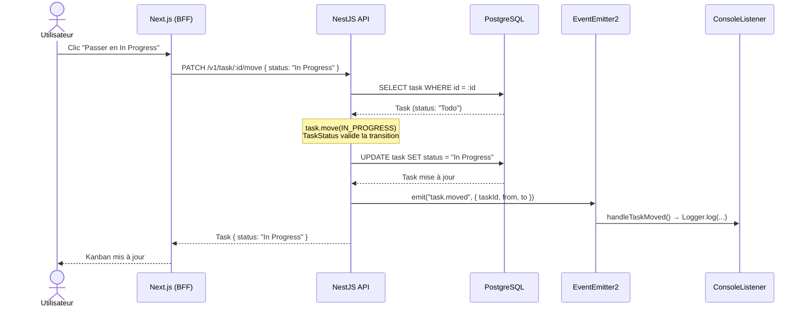

# Architecture — TaskFlow

## Vue d'ensemble

## Flux d'un déplacement de tâche

## Règles d'architecture

| Règle | Application |
|---|---|
| Le domaine ne dépend de rien | `task/domain/` et `project/domain/` : 0 import NestJS / TypeORM |
| Les services passent par des interfaces | `ProjectService` injecte `ProjectRepository` (interface), jamais `TypeOrmProjectRepository` |
| Les règles métier vivent dans les entités | Transitions `TaskStatus`, doublon membre `Project.addMember()` |
| Les services publient et oublient | `TaskService` émet `task.moved` sans connaître `ConsoleListener` |
| Le frontend ne connaît pas le backend | Les composants React appellent `/api/...` (BFF Next.js), jamais `localhost:3000` |
